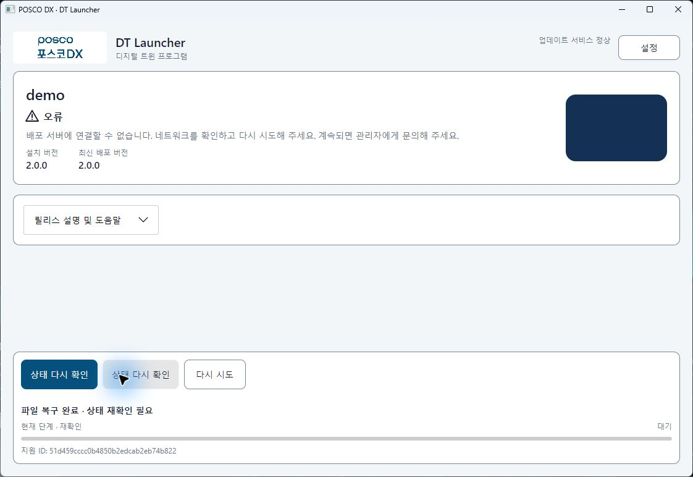
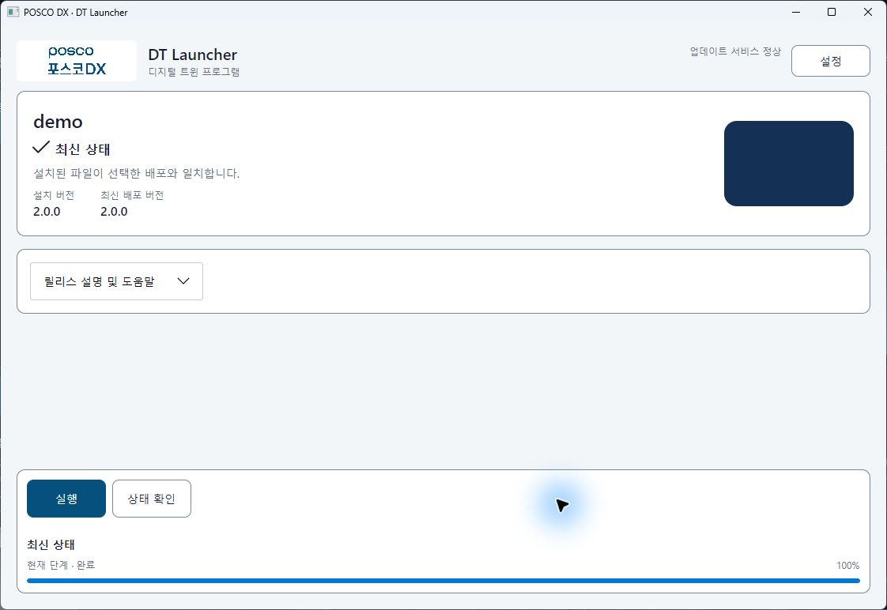
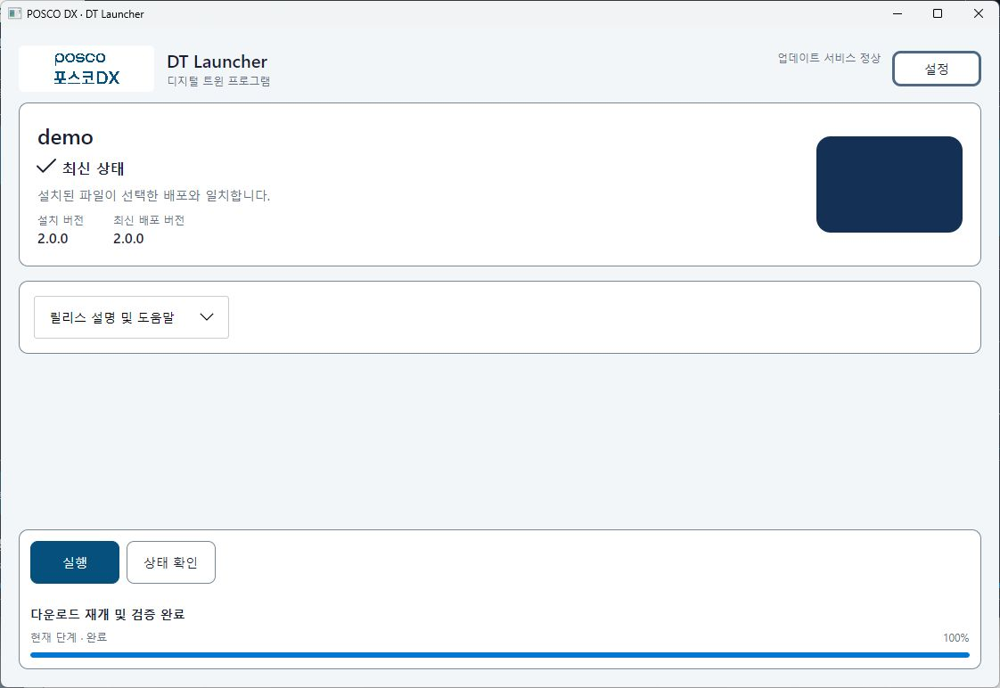
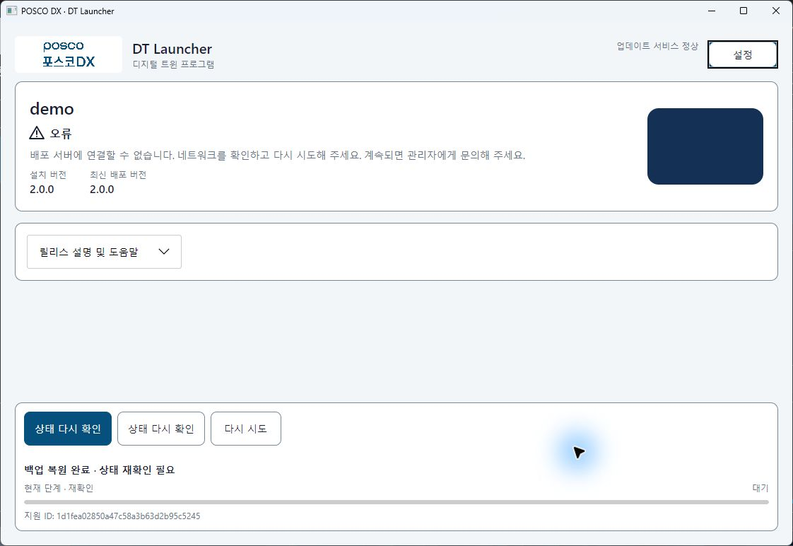

# 클라이언트 재시도·정리·최종 GUI 수용

2026-10-05 / 기준b742750 / codex/client-acceptance-closure. 회사 환경 인수와 합성 로컬 시험을 구분한다.

## 재시도와 적용 후 조회

현재 복원/정리의 retry context를 첫 비동기 I/O 전에 기록한다. 확인 취소는 이전 presentation/상태/유효 resume를 보존하며 preview가 없는 경우 조회로 안내한다. 관리형 preview 응답은 정확한 요청 selection과 비교한다. 사용하지 않는 managed local-path 바인딩을 제거했다. 복구 commit 뒤에는 mutation cancellation을 종료하고 읽기 전용 재확인 제목/단계로 전환한다.

신규18개를 포함한 관련60개 headless/경계 회귀가 통과했다. 실제 retry Button.ClickEvent는 이전 Update/Repair/Launch 호출0건, 확인 취소는 snapshot/resume 보존, 지연된 적용 후 Check는 네 조합 cancel 버튼 제거와 완료 제목/안내 일치를 확인한다.

stage-1 Windows General/Developer/Agent/server publish 후 실제 CLI·console Agent HTTP 요청 서명/readiness/operation/selection-only client/정상 backup IPC 복원 proof가 통과했다. publish source b742750+제품 변경, source hash9ea32560b1761ed541041b2348622c6df0df04b719d9956e520eb0725dd6acf7이다. 이는 최종 GUI 후보가 아니며 실제 GUI/서비스 계정 ACL 통과로 대체하지 않는다.

## 수동 정리 결과

수동 정리는 삭제/실패/실제 잔여 수를 반환하고 일부 실패를 완료로 표시하지 않는다. staging/backups 전용 경로만 허용하며 resume-cache의 파일 목록/크기/수정 시각을 전후 대조한다(전체 내용 hash 인수와 구분). 자동 엔진 Prune의 best-effort 정책은 유지한다. 관련39개 및 stage-2 Windows 게시 CLI/console Agent의 실제 설치/repair/정상 backup 복원이 통과했다. Windows 소유 파일의 delete-sharing handle로 실제 삭제 실패와 해제 후 재정리를 확인했다. Linux는 주입 경계의 권한 거부 시험이며 Windows 잠금 사실로 확대하지 않는다.

stage-2 source2201486+제품 변경/hash ff23541424b7beab85337d430c2470b8551110219efe98941ad7654a47b94156. GUI 정리 실제 적용은 최종 후보에서 별도 수행한다.

## 화면 설정 생성

`sample-config --mode managed-client`는 필수 projectId와 OS/track/version 선택만 출력한다. 운영 필드/프로필·중복/알 수 없는 옵션·exact 버전 누락·latest 버전 혼용을 거부한다. no-force 출력은 원자적 no-overwrite이며 기존 모드는 유지한다. 설정 필요 화면에 키보드로 읽을 수 있는 명령 예시를 제공한다. 관련17개와 stage-3 게시 CLI/console Agent가 실제 생성한 최소 설정으로 doctor/정확한 실행/감독 종료를 통과했다. Developer 게시 EXE의 generator와 build-info도 확인했다. stage-3 sourcef2ab087+제품 변경/hash54ac950d66fbfc42708847bf0392b76872fa476094dbf152364647bebb0d0a9c.

### Linux에서 추가 발견한 설정 생성 경합

Windows785개 전체는 통과했지만 첫 WSL 전체785건은783통과/1실패/1Windows-only skip이었다. `File.Move(overwrite:false)` 동시 작성이 두 번 성공해 기존 설정을 덮을 수 있음을 재현했다. Linux는 RENAME_NOREPLACE를 사용하며 WSL1 파일시스템에서 실제 errno22를 확인해 새로 flush한 임시 설정의 배타적 link 게시→임시 이름 제거를 지원한다. 설치 payload/기존 데이터의 hard link 재사용과 다르며 실패 시 기존 목적지를 변경하지 않는다.

수정한 Windows/WSL 관련10개가 통과했고 WSL 게시 CLI로 설정 생성과 기존 파일 거부를 확인했다. 초기 LF/CRLF patch 적용 실패 뒤 실행된 이전 코드 검사는 수정 증거로 사용하지 않았다. 첫 RENAME_NOREPLACE-only 후보의 WSL2개 실패도 보존하며 최종 전체 회귀/게시본은 뒤에서 기록한다. WSL 임시 mirror 출처는7c6cb1a+명시적 패치이며 Git clean 상태로 보충하지 않는다.

## 최종 시험 도구와 고정 게시본

publisher는 커밋된 Git snapshot에서 General/Developer/Agent/server와 별도 합성 앱을 생성하고 입력 hash·SDK·역할/에디션·runtime sidecar·성공/실패 단계를 기록한다. 새 GUI fixture는 명시적 schema2 cohort manifest와 역할별 실제 경로/hash를 확인한 후 복사하며, 제품 출처와 harness 출처를 분리한다. 이전 root는 조회 가능하지만 최종 GUI 수용으로 채택하지 않는다.

복원 조회 장애는 실제 rollback operation ID/ACK가 아닌 별도 file-transition 관측이다. 정확한 fixture/publication/install/release/backup/fingerprint/새 시도와 손상 사전 inventory·전체 정상 payload/metadata 전환·runtime 불변·설치 잠금 해제를 요구한다. 다른 작업·변경된 preview·미완료 적용·401/403에서는 발화하지 않으며 pending reset과 발화 이력을 보존한다. 게시본×모드×에디션×사례 ledger는 GUI 입력 주체·실제 display 로그·native PNG/JPEG·필수 checks를 요구하고 다른 게시본/비교 scope/CLI 설치/미실행을 전체 통과로 합산하지 않는다.

도구 계약9개/기존fixture23개/proxy4개(합36개)가 통과했다. Windows/Linux final snapshot은 제품18db00d, source hasha93b4a3f89ad61ee9b01c4740ff9a6dcff79a705d0a9a531cacc919ff348a828이며 같은 입력에서 게시했다. 새 managed fixture를 실제 실행하고 상태 버튼 입력·미설치 inventory 불변·display1920×1080/scale1/text1/highContrastfalse를 확인했다. 네 조합 전체 수용은 아직 진행 전/중이며 이 도구 통과가 실제 모든 GUI 적용 통과는 아니다.

이전 병렬 승인3건의 로그에는 IOException 일반 문장만 있어 원인/HResult를 확정할 수 없다. 새 준비는 단계·종료 코드·timeout/start-failed를 원자적으로 기록하고 승인/승격을 별도 기록한다. 새로운 fixture는 순차 준비하며 이를 병렬 실패 해결 증거로 사용하지 않는다.

## 초기 GUI 점검 중 추가 수정

고정18db00d 후보의 실제 개발자 설정 없음 화면에서 주 버튼이 설정 재읽기를 우회해 RunAsync로 진입함을 발견했다. 설정 오류 중에는 양 에디션 주/상태 버튼이 설정 재읽기→조회로 연결되고 주 버튼은설정 다시 확인, 설치 변경/폴더 열기는 비활성화한다. 실제 Button.ClickEvent 네 조합 회귀는 backend Check1회/변경0회·앱 경로 생성0건·확인창0건을 검사한다. 관련14개와 변경 코드의 양 에디션 publish/build-info가 통과했다. 이 제품 수정 후 기존 네 fixture는 보존·소유 harness만 종료했고 다음 고정 후보의 새 root로 영향 시험을 재수행한다.

초기 실제 screen은1920×1080/scale1/text1/highContrastfalse였고 MG 설정 없음/오류/재조회 불변을 확인했다. 캡처는 native JPEG로 제공돼 PNG/JPEG 서명을 모두 지원하고 이후에는 원본 형식 확장자로 저장한다. 초기 일부JPEG.png 이름은 시험 이력이며 최종 공개 근거는 실제 형식을 사용한다.

## 최종 고정 후보 — 75ea591

이후 제품/도구 출처 커밋은 `75ea591082efb460ff63e56f3ddea14253825f5c`, Windows/Linux 제품 입력 SHA-256은 `eda71c82c6bd1254b0bd81813752715ab00140feea1d347bfd8667c43281f124`다. 제품 snapshot은 커밋된 소스이며 출력폴더/중간 빌드가 다른 역할과 섞이지 않았음을 cohort 검사로 확인했다. 현재 문서/앵커 도구 변경은 제품 입력 hash를 바꾸지 않는다. 합성 앱은 별도 시험 asset이며 공식 ZIP에 포함하지 않았다. WSL `/tmp` mirror는 Git checkout이 아니므로 Git clean attestation으로 기록하지 않는다.

| 검증 | 실제 결과 | 한계 |
|---|---|---|
| Windows 전체 회귀 | 789통과/실패0/제외0 | actual GUI 인수와 별도 |
| WSL 전체 회귀 | 788통과/실패0/Windows 전용1개 명시적 제외 | delete-sharing 시험은 Windows 실제 handle 근거. RHEL/서비스 계정 아님 |
| 양 OS snapshot publish | General/Developer/Agent/server·별도 synthetic, Release 경고/오류0 | 코드 서명/설치 수명주기 아님 |
| Windows signed HTTP | readiness·operation·generator 최소 managed display·정확한 launch·정상 backup IPC 복원 통과 | console Agent·같은 OS 계정 |
| Linux signed HTTP | 동일 게시본의 CLI/Agent·readiness/operation·최소 display·정상 IPC 복원 통과 | 실제 RHEL/회사 proxy 아님 |
| Linux HTTPS/Bearer/nginx | sidecar 승인·명시 승격·IP/헤더 거부·Range·폐기·두 버전 실행/repair 통과 | nginx 기본 error-log 경로 경고는 발생. 시험 config 검사/요청은 성공하며 WSL임 |
| 도구 | cohort/restore-witness/ledger9 + fixture evidence23 + fixture contract3 + proxy4, 앵커2 양 OS 통과 | file witness는 Agent 내부ACK 증거가 아님 |

실패한 첫 WSL 후보와18db00d GUI 후보는 앞의 당시 이력으로 보존한다. 최종 성공에 합산하지 않는다.

## 최종 후보 실제 GUI — 18/51 사례 완료, 전체 미완료

2026-10-05 / 입력 주체 Computer Use / 실제 screen1920×1080, RenderScaling1, 앱 글자1, 고대비false. OS 설정을 에이전트가 변경하지 않았다. 네 fixture는 처음에 모두 미설치이며 각기 고유 root와 managed UUID IPC를 사용한다. 초기 설정 시험과 연결 오류의 재조회 전후 **동일 all scope의 payload/state inventory가 불변**이고 실행 marker 생성0건임을 검사했다. 최소 화면 설정은 Agent 보호 설정을 포함하지 않는다. 반대 legacy clientProfile 값도 컴파일된 Light General/Dark Developer를 바꾸지 못했다.

| 조합 | 완전히 통과한 ledger 사례 | 남은 사례 |
|---|---:|---:|
| 관리형 일반 | 9/12: 초기 설정·연결 오류·빈 목록/승격·v1 GUI 설치/수명·v2 취소/재개/명시 실행·복구 후 조회·정상 백업 준비·복원 확인/적용·복원 후 조회 | 3 |
| 관리형 개발자 | 3/13: 초기 설정·연결 오류·v1 GUI 설치/수명 | 10 |
| Portable 일반 | 3/12: 초기 설정·연결 오류·v1 GUI 설치/수명 | 9 |
| Portable 개발자 | 3/14: 초기 설정·연결 오류·v1 GUI 설치/수명 | 11 |

이 수치는 **체크리스트 건수**이며 제품 완성률/개발 공수의 퍼센트가 아니다. 최종 네 조합 집계의 complete=false를 유지한다. 구현된 기능·headless 회귀·게시 CLI 성공만으로 미실행 GUI 사례를 통과 처리하지 않는다.

네 조합 모두 각 GUI에서 최초v1 설치를 시작하고 Manifest3개 전체 hash·정확한 실행 시도·런처 닫기 후 자식 유지·명시 release에 의한 정상 종료·Quiescent를 확인했다. 두 portable은 Agent를 띄우지 않았다. 두 개발자는prod/stable/exact1.0.0 확인창 취소 시all scope 불변을 검사한 후 별도 승인받아 적용했다. v2 exact와 나머지 developer 확인 조건이 아직 없어 `exact-confirmation` 전체 사례는 통과로 올리지 않았다.

### 관리형 일반의 실제 적용

- 실행 직전 사용자 확인을 받고 GUI에서v1 최초 설치. Manifest3개 정상, 정확한1.0.0 marker와 runtime Running 확인.
- 런처 닫기 버튼을 직접 눌렀고 같은 자식 시도의 생존을 확인. 시험 도구의 정확한 release 요청으로 정상 종료했고 Quiescent 확인. 제한시간/watchdog 종료가 아니다.
- 관리자 approve/promote로v2를 공개한 뒤 GUI는 기존1.0.0/최신2.0.0/업데이트 후 실행 표시. v1 protected snapshot을 보존했다.
- 사용자 승인 후 실제512KiB/s 전송에서 `activeFiles=1`과 양수 수신 바이트 확인 후 GUI 취소. 종료 후activeFiles0, 즉시 다운로드 재개 표시, 자동 실행0건.
- 별도 사용자 확인 후 GUI 재개. 같은 proxy 세션의 Range 시작11993088, 취소 직후 throttledBytes12025856, 완료4파일 hash 정상·v1 protected 불변. 취소/재개 버튼은 완료 후 사라졌다.
- 별도 사용자 확인 후v2 명시 실행. 정확한2.0.0 시도·Running·취소 버튼 없음/불필요 지원ID 없음 확인. 생존 중 상태 조회 전후 protected 동일. 종료 요청 뒤 Quiescent 확인.
- 위 마지막 관측은 일반 화면의 실행 차단/조회 부분 근거다. 숨긴 update/repair/rollback/정리의 모든 진입점 직접 시험은 아직 없어 `runtime-protection` 전체 사례를 통과로 올리지 않았다.

### 2026-10-06 — 승인된 복구와 조회 전용 재시도

같은75ea591 제품/cohort에서 관리형 일반의 문제 해결을 실제 클릭했다. exact v2의 version.txt 손상 후 서명된 Manifest4파일이 정상으로 복구됐고, 정확한 repair 작업/Manifest digest에 결속한 Catalog 조회 장애1회가 발생했다. 화면은 `파일 복구 완료 · 상태 재확인 필요`였으며 취소·재개 버튼과 복원 제안은 없었다.

서버를 다시 정지한 상태에서 주 버튼·상태 버튼·다시 시도를 각각 눌러 조회만 수행한 뒤, 서버 재시작 후 F6로 최신 상태에 복귀했다. 동일 protected scope 설치/Manifest/backup/journal과 작업 기록5개 전체 hash는 불변, repair 기록은1개로 추가 적용0건이었다. 반복된 조회 자체의 실패 제목은 `상태 확인 실패`이며 파일 복구 실패/재복원으로 처리하지 않았다. 정상 설치 상태 확인도 추가 복구·실행 없이 종료했다. v1 protected 불변과 기존 앱 marker의 종료 상태를 확인했다.

실제 증거 JSON에 한글 결과를 기록하자 Python의 Windows 기본cp949 읽기가 실패했다. 이는 제품 복구 실패가 아닌 도구 오류였다. `2037dc0`에서 UTF-8/BOM proof reader·ledger 읽기를 수정하고 `1248251`에서 실제 stream 읽기도1MiB로 제한했다. Windows/WSL 각11개 도구 회귀(신규2개 포함), 같은 게시본의 실제 한글 proof 등록을 통과했다. 제품 입력 hash/바이너리는 바뀌지 않았다.

추가 승인 후 같은 root의 **보조 Developer exact2.0.0** 검증/복구로 정상 백업 `20261005150434`를 생성하고 전체4파일 hash를 확인했다. 이는 General 정상 문제 해결이 강제 repair한다는 증거가 아니라 복원 시험 준비다. 앱은 실행하지 않았다. 완료 캡처에 외부 보안 프로그램 창이 겹쳐 입력을 중단하고 사용자에게 화면 정리를 요청했다. 사용자가 직접 정리한 뒤 정상 런처 캡처를 다시 확보해 정상 백업 사례를 통과로 기록했다. 보안 앱/설정은 조작하지 않았으며 다른 창이 포함된 캡처는 아카이브에 저장하지 않았다.

### 현재 남은 수용 및 재개 조건

복원 시험: 정상 백업 준비 후 test-only cache를 끄고 합성version.txt만 다시 손상시켰다. 인증을 통과한 version.txt 응답에만503을 주어 General 문제 해결의 복구 실패→복원 확인창 경로를 직접 확인했다. 확인 취소와, 두 번째 새 preview를 연 뒤 backup metadata whitespace를 바꾼 적용 거부 모두 동일 protected inventory 불변이었다. 후자는 `백업 정보 변경` 안내/지원ID를 표시했고 정상 백업4파일도 유지됐다. 입력 캐시 오류1건은 대상 창 재관측 후 좌표 입력으로 복구했으며 제품 실패로 기록하지 않았다. 세 번째 새 preview/확인창 뒤 별도 승인으로 정상 백업을 적용했다. file-transition witness e3b488a481a344aea4eb36a49fbe2df6가 정확한 설치·백업/fingerprint·전체4파일/Manifest/설치 상태·잠금 해제 전환을 관측한 뒤 Catalog 오류1회를 발생시켰다. 이는 rollback operation ID/Agent ACK 관측이 아니다. 화면은 백업 복원 완료 · 상태 재확인 필요였고 취소/오래된 재개 버튼은 없었다. 실제 다시 시도 클릭 후 최신 상태로 복귀했으며 protected hash 불변·재복원0건·v1 보존·앱 실행0건을 확인했다. 이 두 General 사례를 통과로 기록했고 다른 세 조합으로 확대하지 않았다. test-only file/Catalog 오류는 해제하고 정상 설치/백업은 보존했다.

[General 복원 확인창](client-acceptance-closure-screens/managed-general/general-normal-backup-confirmation.jpg) · [변경preview 거부](client-acceptance-closure-screens/managed-general/general-changed-preview-rejected.jpg)

다른 세 조합의v2 취소/재개/명시 실행, 관리형 일반 외 빈 목록/승격 전수, 두 개발자v2 exact, 네 조합 실행 중 모든 변경 차단, 다른 세 조합의 문제 해결·복구 후 조회·정상 백업·복원 취소/preview 거부/정상 적용/file-witness 조회 장애, portable 개발자 정리 부분 실패·정리만 재시도, GUI 진단과 인증 오류 전수를 수행해야 한다. 실제 적용 버튼은 Computer Use의 실행 직전 확인 규칙을 지킨다. 같은 후보/root를 재개할 수 있으며 오래된 fault/작업/runtime 상태를 preflight로 먼저 확인하고 자동 초기화하지 않는다.

현재 USER-02/UI-02/USER-03/UI-03은75%, UI-01은 합의한1920×1080 한정100%다. 다른 해상도/DPI·음성·회사 서비스 계정ACL·UE/RHEL·인증서·원격CI·회사 운영 승인은 미검증 그대로다. 개선대장 완료6/부분19/대기3/열린22개를 유지한다. push/PR은 하지 않았다.

[정제된 사례별 JSON/바이너리 hash](client-acceptance-closure-results.json) · [관리형 일반 화면](client-acceptance-closure-screens/managed-general/) · [관리형 개발자 화면](client-acceptance-closure-screens/managed-developer/) · [Portable 일반 화면](client-acceptance-closure-screens/portable-general/) · [Portable 개발자 화면](client-acceptance-closure-screens/portable-developer/)

