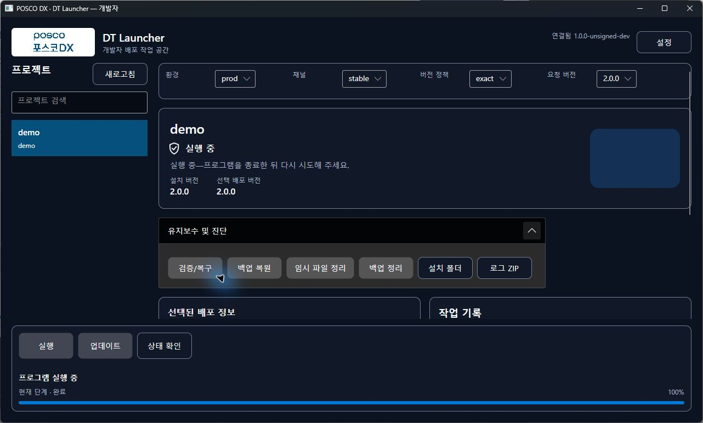
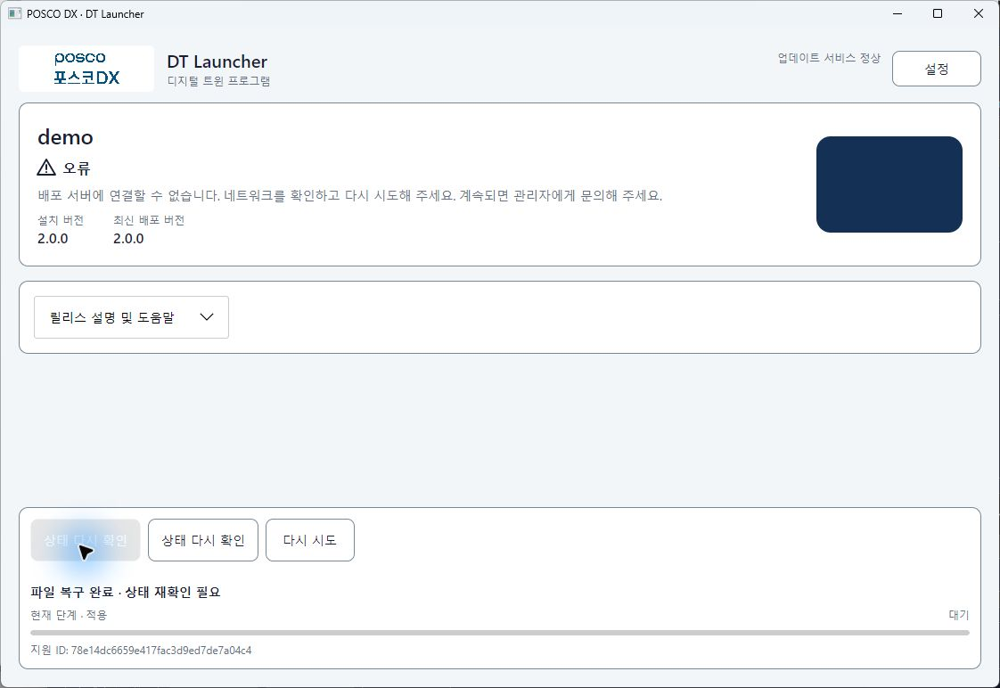
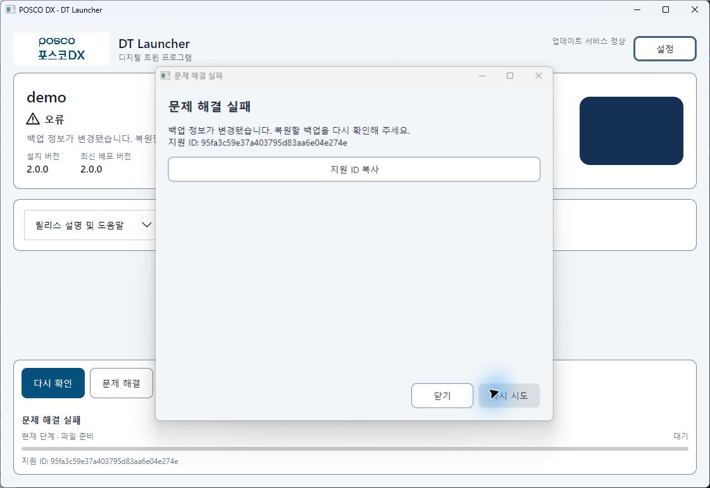
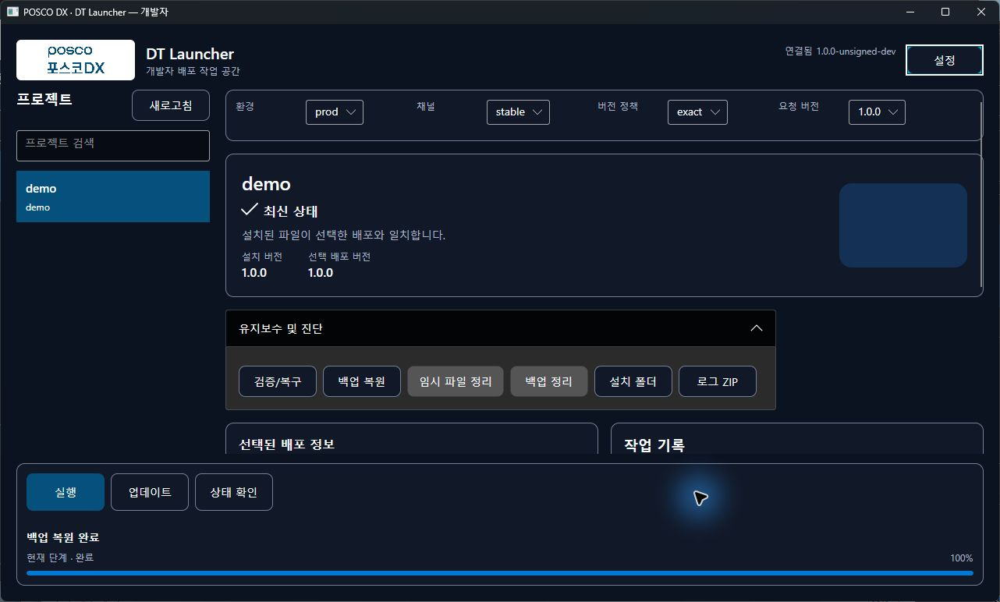

# 클라이언트 권한·유지보수·GUI 수용 후속

2026-10-05 / 기준dea2d18 / codex/client-usability-hardening.

## 최신 결과와 판정

기능 수정은 커밋별로 검증했다. 최신 제품 소스 a241397의 Windows/WSL 각753개(실패/skip0), 양 에디션·Agent·서버 Release publish, 양 OS HTTP 요청 서명/readiness/operation/최소 관리형 client/IPC 정상 복원, Linux HTTPS/Bearer E2E가 통과했다. 새 계정·서비스 설치·실제 ACL·회사 UE/RHEL·인증서·내레이터·push/PR은 수행하지 않았다.

실제 마우스 입력은 Computer Use로 합성 창에만 수행했다. screen1920×1080/work area1920×1032/RenderScaling1/app text1/high contrastfalse를 관측했다. 초기 후보들의 IPC 이름 충돌 및 도구 실패와 최종 후보를 구분한다. **아래 일부 GUI 성공을 최신 후보 네 조합 전체 통과로 합산하지 않는다.** USER-02/UI-02는75%, USER-03은 실제 네 조합 취소/재개·로컬 회귀 근거로75%, UI-03은음성 미검증75%다. 완료6·부분19·대기3·열린22개를 유지한다.

### 게시본 출처

| 후보 | 제품 소스 SHA-256 | 검증 범위 |
|---|---|---|
| final-win2 / final-linux2 | b393a6dc315f7c39b411cdd357da61fdfc11d13b882a300d1b40a3765fcff0b1 | 제품 c6ede74. Windows 게시 시72233f7+변경, Linux c6ede74 clean. 각752개와 인증/IPC/HTTPS, 네 GUI 부분 수용 |
| final-win3 | 5934cd8f9453d86e5ef865057dc02e7da671d482c36dfeb054818c2ee66650c5 | 게시 당시c6ede74+변경, 이후a241397에 같은 소스 commit. Windows753개/CLI E2E, 관리형 개발자 직접 복원 영향 시험 |
| Linux final3 | a241397 Git archive | Git 없는 /tmp mirror. clean attestation을 보충하지 않음.753개와 양 에디션/Agent/서버 publish·HTTP/HTTPS 실제 실행 |

final-win3 EXE hash: General10fbe1871f359a86a20656781e2b22af24748d55e36c017891e8aba61d89e4b8 / Developer857e193a71deda5108990330c857676fd021e48adb0c1d97b949e7813ee1655f / Agent5a27d1bc7b4a376fe5c9b64f520e594bec63f84e987d9299eb9202cb2bc2dde8 / Serverb34de486bdf4ef435e64c7748c37e132fbeaaca4c0885fee9bf469de952e2bf1. 회사 서명 파일이 아닌 UNSIGNED-DEV다.

### 직접 GUI 시험

MG=관리형 일반 accept-mg4, MD=관리형 개발자 accept-md4, PG=portable 일반 accept-pg3, PD=portable 개발자 accept-pd4. 모두 final-win2의 독립 신규 root/고유 IPC이며 최초 설치를 CLI로 수행하지 않았다.

| 사례 | MG | MD | PG | PD |
|---|---|---|---|---|
| v1 최초 GUI 설치/실행·전체3파일 hash·GUI 종료 후 자식 유지·명시적 정상 종료 | 통과 | 통과 | 통과 | 통과 |
| v2 수신 중 취소·즉시 재개·Range·전체4파일 hash·자동 실행0·v1 보호 | 통과 | 통과 | 통과 | 통과 |
| v2 명시적 실행·Running 생존/보호 hash 불변 | 통과 | 통과 | 통과(일반 주버튼) | 통과 |
| update/repair/rollback 차단 | 보조 개발자 창 포함 통과 | 통과 | 일반 주버튼 확인, 개발자 전수 남음 | 정리 포함 통과 |
| 손상 복구 성공·후속 조회 장애·파일 정상·조회만 재시도 | F6 통과 | 정상 복구 통과, 장애 미실행 | 주버튼 통과 | 정상 복구 통과, 장애 미실행 |
| 정상 상태 추가repair·전체 정상 backup | 20261005104124/4파일 | 20261005105030/4파일 | 미실행 | 20261005104727/4파일 |
| 복원 확인 취소·preview 변경 거부·새 확인·정상 적용 | 통과 | 직접 버튼 결함 발견→final-win3 재시험 | 미실행 | 통과 |
| 임시 파일 정리·payload/backup 불변 | managed 비활성 확인 | managed 비활성 확인 | 해당 없음(보조 개발자 시험 남음) | 통과 |
| 네 조합401/403/빈 목록/잘못된 공개키/설정 오류·조회재시도 전수 | 미실행 포함 | 미실행 포함 | 미실행 포함 | 미실행 포함 |

MD 영향 재시험: final-win3의 새 accept-md6에서 v1을 실제 GUI 업데이트 버튼으로 최초 설치(앱 실행 없음), 정상 상태 repair로 정상 backup20261005110032/전체3파일 검증, 시험 version.txt 손상, 직접 복원 preview 취소 불변·metadata 변경 거부 불변·새 확인·정상 복원3파일 hash 통과. 로컬 install root 미해석 회귀 Button.ClickEvent도 통과했다. 이는 final-win3의 전체 설치/실행 행렬 통과가 아니다.

최종 남은 수용 체크리스트는 [설정/사용 가이드](../../guide-03-launcher-usage.md#현재-gui-수용-체크리스트)를 따른다. 특히 portable 일반 정상 백업/복원, 마지막 후보 전체 오류 전수, 복원 적용 후 실제 조회 장애, 서비스 계정 ACL은 미완료다. 단위/IPC의 성공을 해당 GUI/계정 통과로 대체하지 않는다.

### 전송·수명·복구 근거

| fixture | 취소 시 throttled bytes | 재개 Range 시작 | 결과 |
|---|---:|---:|---|
| MG | 24,444,928 | 24,412,160 |4파일 정상, v1 all scope 불변 |
| MD | 26,574,848 | 26,542,080 |4파일 정상, v1 protected 불변 |
| PG | 22,904,832 | 22,872,064 |4파일 정상, v1 protected 불변 |
| PD | 취소 직전24,707,072 이상 관측(취소 완료 시 별도 값 미기록) | 30,441,472 |4파일 정상, v1 protected 불변 |

Range와 서버 전송량은 proxy session 시작값 대비이고 부분 파일 재검증 전제를 유지했다. marker는 runtimeAttemptId와 일치하며 v1 창 종료 시험과 v2 차단 시험 직전/직후 ended=false·Running을 관측했다. MG의 첫 v2 시도는 긴 검사 대기로 watchdog 종료해 차단 증거로 사용하지 않았고 새 시도141888a9de27451e89ce6a8f73c9d452에서 실제 차단을 확인했다. 오래된 marker나 timeout을 정상 사용자 종료로 합산하지 않는다.

MG/PG 복구 직후 Catalog 오류는 실제 repair operation ID·릴리스 tuple·Manifest digest·Completed에 결속돼 proxy catalogFaults1을 확인했다. MG는 F6, PG는 주 버튼 재조회 전후 protected snapshot 불변·정상4파일을 확인했고 복원 제안0건이었다. 모든 버튼16개 headless 회귀는 별도 근거다. 실제 두 경로를 네 조합의 모든 버튼 클릭으로 확대하지 않는다.

### 실패 이력과 환경 제약

- 초기 basename IPC endpoint가 다른 기존 fixture와 충돌했다. UUID endpoint 및 실제 Agent operation registry 위치로 수정했다. 이 초기 root들은 설치 클릭 전에 무효화했고 통과에 합산하지 않았다.
- final-win2 네 root 병렬 준비 중3개 approve가 IOException으로 실패했다. 원인은 확정하지 않았으며 원본 실패 root를 보존했다. 새로운 root를 직렬 준비해 진행했고 이를 병렬 접수 정상 보장으로 해석하지 않는다.
- Linux final2 최초 full run은 동시 SQL/HTTP 권한 시험1개가 예상403 대신500으로 실패했다. 동일 시험 및 전체 재실행752개, 최종final3 전체753개는 통과했다. 최초 실패를 삭제하거나 원인이 해소됐다고 선언하지 않는다.
- 잘못된 게시 경로/합성 EXE 이름을 사용한 도구 실행은 시작 실패로 기록하고 새 root로 재수행했다. 전송/설치 제품 실패와 구분한다.
- Linux archive의 CRLF bash는 mirror에서만 LF로 정규화했다. nginx 격리 config 시험은 성공했지만 기본 /var/log/nginx/error.log 부재 alert가 남았다. 실제 RHEL·대용량 프록시 검증으로 확대하지 않는다.
- MG v1 all snapshot을 protected scope로 비교하려던 호출은 도구가 거부했다. 같은 all scope로 재비교해 통과했다. 서로 다른 scope를 동일 비교로 처리하지 않았다.

정제된 요약은 [JSON](client-usability-results.json), 검토한 화면은 아래와 같다. 키·DB·설정 전문·원시 로그·payload는 Git에 넣지 않는다.

## 관리형 경계

관리형 GUI는 화면 설정에서 선택만 투영한다. 운영 설정 loader·설치 Manifest 사전 읽기를 제거하고 Catalog/진단/실행을 Agent에 위임한다. 관리형 로그는 사용자별·화면설정별 경로이며 저장 공간 요약은 서비스 관리 안내다. GUI는 서비스 전용 설정으로 자동 fallback하지 않는다. 바로가기 프로필에는 관리형 모드·정확한 릴리스만 저장하고 기존 사용자 파일을 덮어쓰지 않는다. IPC v1의 선택적 ClientPresentation 정보는 릴리스·설치 식별자와 결속한다.

관련 회귀81개, 관리형/진단 추가 회귀47개 통과. 게시 stage-a4 CLI/console Agent의 HTTP 요청 서명·준비도·취소/재개·설치/실행/repair와 선택-only 최소 관리형 설정의 doctor/정확한 실행/감독 종료가 통과했다. 제품 소스 hash는b8d18516d6685347bfa5ebb6c7e4d0da055218b19120b830c2a97e98de84cdf5이며 publish 당시dea2d18/제품 변경 존재를 기록했다. 이 소스는 최종 GUI 후보가 아니다.

새 계정·Windows 서비스 설치·회사 ACL 인수는 수행하지 않았다. 기존714개를 포함한 최종 양 OS 전체 회귀와 새 고정 게시본의 네 GUI 조합 수용은 다음 단계다. 과거 후보의 성공을 새 후보의 실제 클릭으로 합산하지 않는다.

## 완료 후 재확인

복구/복원 후 상태 확인이 필요한 상태에서 실제 주/상태/재시도 버튼과F6는 조회만 수행한다. 네 조합의 실제 버튼 이벤트·headless 키 입력을 포함한 회귀와 적용/검사 실패 경계가 통과했다. 관리형 복원은 적용 성공을InstallationCommitted로 보존하고 조회 불가/응답 불명 시 재확인을 요구한다. 오래된 재개 힌트와 변경 버튼을 차단한다.

Windows 전체741개(714+27), 실패/skip0. stage-b 게시 CLI의 최소 관리형 설정·실제IPC 정상 백업 복원·선택 결속·전체 해시·완료 플래그가 통과했다. 첫 cli-b는 도구가Selection의 계산된releaseId 추가 필드까지 동등 비교해 실패했으며 필수5필드 비교로 수정한 새cli-b2는 통과했다. 첫 실패는 제품의 복원 실패로 기록하지 않는다. 이 후보는 최종 GUI 수용 전 단계이며 같은 계정 console Agent 결과는 서비스 계정 ACL 인수가 아니다.

## Portable 유지보수

임시 파일/백업 정리는 정확한 선택의 설치 잠금·runtime 재검사·미완료 journal 검사를 거친다. maintenance는 runtime 초기화 기록을 생성하지 않는다. staging 정리는 resume cache를 보존하고 backup은 기존 보관 개수를 따른다. 링크를 거부하며 UI 로그는 UI 스레드에서 집계한다. 설치 폴더는 존재하는 선택 경로만 열고 생성하지 않는다. 관련43개(신규9 포함)와 stage-c 양 에디션 게시 CLI의build-info 시작 확인을 통과했다. 실제 GUI 정리 조작은 최종 후보에서 별도로 수행한다.

## 시험 결속

Catalog 오류 제어는 실제 신규 작업ID를 한 번 고정하고 릴리스5필드·command·Manifest SHA-256·Completed를 모두 대조한다. 발화 기록과 프록시 세션을 보존하며 reset은 파일 오류와 미발생 Catalog 오류를 함께 해제한다. 계산된releaseId 추가 필드는 필수 선택 필드와 혼동하지 않는다. 합성 marker는 runtimeAttemptId와 결속하고 watchdog 종료 사유를 루프 종료 시 확정한다. 새 합성 실행 파일의 독립 수명 시험은 제한시간 경계를requested로 오인하지 않음을 확인했으며 GUI/감독 수용으로 합산하지 않는다.

## 개발자 직접 복원 경로에서 추가 발견한 결함

final-win2 관리형 개발자 직접 백업 복원 버튼에서 `Versioned install root must be resolved first` 오류를 재현했다. 문제 해결의 복원 제안 경로는 통과했지만 직접 버튼은 selection-only 설정에 portable 경로 바인딩을 적용하고 있었다. 관리형은 ManagedClientContext.Bind, portable만 VersionedReleasePaths.Bind하도록 수정했다. 실제 Button.ClickEvent 회귀는 보호 설정 loader 호출0건·정확한 선택·로컬 루트 미해석을 확인한다. 관련8개와 Windows 전체753개가 통과했으며 final-win3 게시 CLI/console Agent의 HTTP 서명·readiness·작업·최소 관리형 설정·정상 backup IPC 복원 proof가 통과했다. final-win3 source hash는5934cd8f9453d86e5ef865057dc02e7da671d482c36dfeb054818c2ee66650c5이고 게시 시 c6ede74/변경 존재를 기록했다. 직접 GUI 복원 재검증과 Linux 최종 회귀는 별도로 기록한다.
