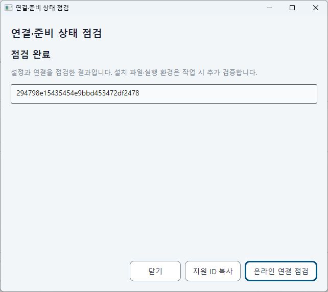
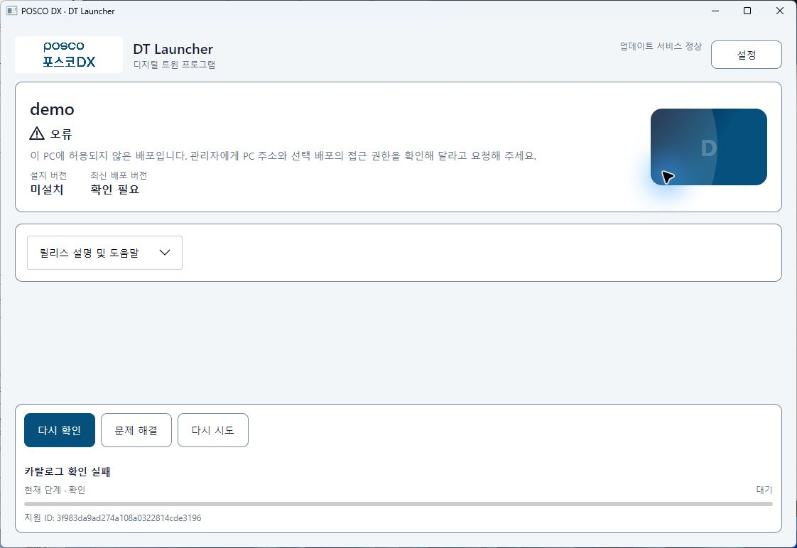

# 최초 연결 진단·오류 해결 검증

검증일: 2026-10-03 KST. 기준71d8e74, 작업브랜치 `codex/launcher-readiness-ux`.

## 변경과 보호 경계

- 검사 상태/주체/코드/조치 담당/다음 조치/정확한 대상/지원 ID/준비도 추가. 기존 JSON·IPC v1·0/1 종료 코드 유지.
- 오프라인 설정 검사에서 legacy 이전·state 생성·portable credential 경로의 디렉터리 생성을 제거. CLI 진단 진입은 pending self-update 적용을 건너뛴다.
- 관리형은 capability 확인 후 Agent 보호 설정을 사용한다. 진단 요청을 앞단 프로젝트 작업 로딩과 분리하고 target 적용 후 설정을 다시 검증한다.
- 일반 latest는 현재 허용 트랙의 승격만 인정한다. exact 조회는 권한 안의 승인판을 인정한다. 정상 빈 목록과 승격 대기를 구분한다.
- GUI 설정 안에 준비 상태 점검, 선택 변경/닫기 시 결과 폐기·취소, 마지막 진단을 포함한 지원 ZIP 추가. 점검이 주 화면의 설치/runtime 상태를 덮어쓰지 않는다.

## 게시본과 증거 구분

1. `step-01`: 오프라인/형식 회귀16개, publish CLI의 누락 설정 실행. `8e42536`.
2. `step-02`: 선택·권한·기존 응답 회귀, 실제 HTTP 요청 서명·관리형/portable doctor·설치/실행/repair·폐기 키 거부. `cc7ff02`.
3. `step-03`: 실제 설정→오프라인/온라인 진단 창과 승격 대기·조치 안내. Windows/WSL 각585개. `5e3a247`.
4. `final`(아래 GUI 이력): 제품 출처5e3a247 + target 재검증/빈 검사 보류 수정. 동일 GUI/Agent/서버/합성 앱을 고정해 실제 조작했다. 바이너리와 fixture의 source diff를 기록했다.
5. `final-02`: GUI401 점검에서 발견한 주 화면 조치 문구 누락을 수정한 후보. Windows/WSL 각587개, 새로운 publish·영향받은 오류 화면을 별도로 확인한다. 서로 다른 게시본의 성공을 최종 전체 수용으로 합산하지 않는다.

최종 소스는 `d665d67`이다. `final-02`의 GUI/CLI SHA는 eaff390dc6ec75aea18dfd2c0a19501b99f1208909b856e43da06fe7ce87c0ac이며 Agent/서버/합성 앱은 위 `final` 이력과 동일한 해시다. 새 후보 Windows HTTP/양 모드 doctor·설치/실행/repair·폐기 키 시험도 통과했다. WSL 최종 근거는 /tmp/uedt-data-safety.gtgjrY의587개 및 /tmp/uedt-intranet-06lcfd3n, /tmp/uedt-distribution-e2e.Tl65iz이다. 원시 폴더는 커밋하지 않는다.

`final` Windows SHA-256:

| 제품 | SHA-256 |
|---|---|
| GUI/CLI | 3d453707c30d8ce933302b06a6b43d854d60f5689cd444e785d9ba9e1faa1263 |
| Agent | b342f15b688a976d2c0e466250883fbed9647d74ab01ecab112a475d94db3aa9 |
| 서버 | 2f31d6715a9892e27b47ca87329ff521c73b5b81481f0a45252e0cf8c535a5f2 |
| 합성 앱 | 01d57c521501d2e93efce1cf44efb707f55c80f176e758028c0daaa5617e6ddf |

fixture 출처는 HEAD5e3a247·dirty diff SHA d7960f7b9a618f36869e7ad87342f266a81d6cd4012084998f2a2754de5fa577이다. 제품과 이후 확장한 시험 도구 출처를 구분한다. 실제 UE 또는 회사 서비스 계정 시험이 아니다.

## 실제 Windows GUI 이력 (`final`)

모두 에이전트가 computer-use로 격리된 합성 앱만 직접 조작했다. 로그의 screen1920×1080, work area1920×1032, RenderScaling1, 앱 글자1·고대비false를 대조했다. OS/prefs는 변경하지 않았다. CLI 선설치 없이 시작했다.

| 사례 | 관리형 | Portable | 근거 |
|---|---|---|---|
| 승인만 있는 최초 대기 → promote → 조회 | 통과 | 통과 | 비활성 주 버튼·관리자 미지정 안내 → v1 설치 버튼 |
| 미설치 단절 → 재연결 → 조회만 재시도 | 통과 | 통과 | uninstalled snapshot 동일, marker 없음 |
| GUI v1 설치/실행 | 통과 | 통과 | Manifest 전체3파일·v1 marker·Running |
| GUI 종료 중 자식 유지·자연 종료 | 통과 | 통과 | 종료 전후 running snapshot 동일·ended marker·Quiescent |
| v2 승인/승격 → 업데이트/실행 | 통과 | 통과 | 기존v1·최신v2 안내·v2 marker·v1 snapshot 동일 |
| 개발자 exact v1→v2 선택 | 통과 | 통과 | 선택 컨트롤·버전 카드·runtime 관측 일치 |
| Running 중 update/repair/rollback 차단 | 통과 | 통과 | 살아 있는 marker와 비활성 버튼·보호 snapshot 동일 |
| 일반 손상 문제 해결 → 복구·재검증 | 통과 | 통과 | 파일 복구 완료·전체3파일 정상·새 실행 없음 |
| 정상 설치 문제 해결 | 통과 | 통과 | 설치 상태 점검 완료·snapshot 동일·새 marker 없음 |
| 정상 상태에서 추가 repair·정상 backup | 통과 | 통과 | 관리형20261002152642, portable20261002154559 각3파일 정상 |
| 복원 취소 | 통과 | 통과 | restore-cancel snapshot 동일·이전 제목 유지 |
| 정상 backup 적용 | 통과 | 통과 | 전체3파일 정상·복원 완료 제목·v1 불변 |
| preview metadata 변경 후 적용 거부 | 통과 | 통과 | 변경 후 snapshot 동일·backup-preview-changed·새 확인창 요구 |
| 개발자 v2 실행 확인 취소·승인 | 통과 | 통과 | 취소 snapshot/marker 불변, 승인한 v2만 시작·창 종료 후 자식 유지 |
| 일반 진단403 / 빈 목록 / 서명 오류 / 정상 재시도 | 통과 | 통과 | 다른 안내·담당/조치·지원 ID·diagnostics-normal snapshot 동일 |
| 잘못된 표시 설정 → 수정 → 조회만 재시도 | 통과 | 통과 | sentinel 미노출·지원 ID·configuration-retry snapshot 동일·marker 추가0 |
| 실제 GUI401 | 통과 | 아래 후속 기록 | managed 키 폐기 후 PC 인증 안내. 다음 조치 누락을 발견해 final-02로 수정 |

구형 Agent(a8080ea 게시본)를 실제 실행한 별도 시험도 통과했다. 새 CLI는 read-only-doctor-v1 부재를 client-upgrade-required로 반환하며 보호 config/state/apps/credential inventory가 동일했다. 두 모드 CLI 지원 ZIP의 doctor.json·비밀 검사·관리형 보호 state 제외도 통과했다.

## 자동화·프로세스 증거

- Windows/WSL 각587개 전체 회귀. 초기 추가 테스트의 기대 예외 형식 한 건을 실제 InvalidDataException에 맞춰 수정하고 재실행했다. 최초 실패를 통과 이력으로 바꾸지 않는다.
- 최종 후보 이전 Windows/WSL 각585개도 별도 이력. Python fixture 계약13개 통과. 최초 unittest discover는0개였고 파일을 직접 실행해13개를 확인했다.
- Windows HTTP 실제 CLI/Agent/서버: 양 모드 offline inventory 불변, 미승격·exact·미허용 프로젝트 진단, 2버전 설치·실행·repair·폐기 키 거부.
- WSL HTTP 요청 서명과 nginx HTTPS/Bearer·IP/header 거부·Range·토큰 폐기·두 버전·실행 권한·repair 통과. 최종 후보별 결과는 정제 JSON에서 구분한다.
- nginx 기본 /var/log 경로 alert가 있었으나 격리된 설정 문법 및 E2E는 성공했다. 시스템 로그 경로/서비스는 수정하지 않았다. WSL1 대용량 제한을 해결한 것으로 표시하지 않는다.

## 입력 도구와 완료 판단

입력 도구의 cached state/geometry/activation 오류가 간헐적으로 있었다. 현재 창을 다시 선택·활성화·관측해 재시도했으며, 다른 앱의 화면이 캡처된 경우 그 좌표로 입력하지 않고 대상 일치를 확인했다. 화면 불일치는 제품 성공/실패 증거로 사용하지 않았다.

USER-02·UI-02의 최신 후보 전체 수용 판정은 미실행 사례와 구분한다. UI-01의1920×1080 제한 범위·UI-03 음성 보류75%·USER-01 실제 UE 데이터50% 및 회사 운영 조건은 별도다. 키·원시 로그·DB·패키지·시험 설치는 Git에 넣지 않는다.

### final-02 영향 시험과 사용자 중단

새 후보의 일반 화면 양 모드에서403 원인·관리자 조치·지원 ID를 직접 확인했다. 이전401 화면에서 발견한 조치 문구 누락은 공통 오류 문구 보강과 추가 회귀2개로 수정했다. 새 후보의 전체 GUI 수용을 이전 후보의 성공과 합산하지 않는다.

2026-10-03 사용자가 마우스 검증을 잠시 멈추도록 요청했다. 이후 마우스·키보드를 포함한 GUI 자동 조작을 중단하고 열린 fixture 창과 백그라운드 시험 서비스를 유지했다. 남은 새 후보 GUI 재시도/진단/설치·복원 전체 수용은 재개 전까지 미실행이다. 코드/587개 회귀/게시 E2E 완료와 이 보류를 분리하여 USER-02·UI-02는75%로 유지한다. [정제 결과](readiness-evidence.json)
