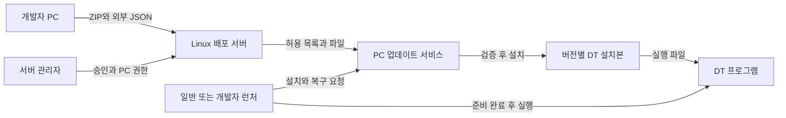
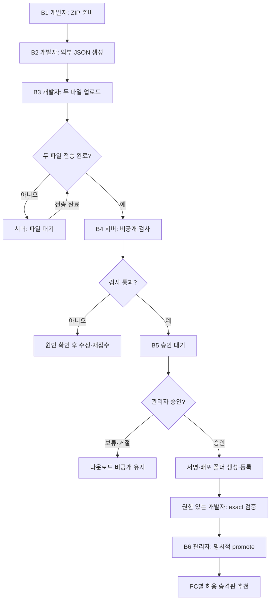

# DT 배포 시스템 — 기능 지도와 단계별 실행 안내

확인일: 2026-10-03 / `codex/operations-hardening-closure`. **현재 구현된 기능**이며 회사 운영 승인 완료가 아닙니다. HTTP A(최초 준비)는 [PC 서명](intranet-auth.md), HTTPS/Bearer는 해당 모드 예제를 따릅니다. ZIP/검사/승인/개발자 확인/**명시 승격**/권한별 추천은 공통입니다. 먼저 한 문장으로 이해하면:

> 개발자가 ZIP과 설명서를 올리면 서버가 검사합니다. 관리자가 승인·실행 버전 승격을 하면, 허용된 PC의 사용자가 설치하고 DT 프로그램을 실행합니다.

## 추가 운영 — 마우스 없이 가능한 작업

아래 명령의 서버에는 `--config server.json`, 클라이언트에는 실제 설정/endpoint를 지정한다. 예시 이름은 회사값으로 바꾼다.

| 담당/위치 | 순서와 명령 | 정상 결과 / 보호 |
|---|---|---|
| 사용자 CLI | `run --config config.json --no-launch` → 출력된ID로 `operation status --id ID` | 정확한 릴리스 상태 확인. 새 실행은 온라인 인증/권한 필수 |
| 사용자 CLI | `operation cancel --id ID` → status로종료확인 → `operation resume --id ID` | 요청≠취소 완료. workers/복구 종료 대기, fresh 권한/Manifest 재확인 |
| portable 사용자 | 위 control 명령에 `--config portable.json` 추가 | Agent 없이 자기 owner/session 기록만 사용. 지속 캐시는 명시 resumeCacheBytes 예산 |
| 서버 관리자 | 새 자격 등록·연결 확인 → `token-list`/`token-revoke-id --id ...` 또는 `client-key revoke --key-id ...` | 비밀 출력 없이 개별 폐기. `--expires-at` 지정 없으면 기존 무기한 유지 |
| 서버 관리자 | 서버/watch 중지 → `backup plan` → `backup create --output 새폴더` → `backup verify --backup 폴더` | 일관된 DB/파일 hash, private key 별도 보관 |
| 서버 관리자 | `restore stage --backup ... --target 빈폴더` → `restore activate --target ... --confirm` | 최신 생존 원본의 보안/승격/순번/파일 대조. 불명·누락은 공개 차단 |
| 서버 관리자 | `retention inspect` → `retention plan --jobs 실패ID --output 계획.json` → 정지후`retention apply --plan 계획.json --confirm` | public/모든승격/pending/active 보호. stale/재생성은 새확인 |
| 회사 운영자 | disabled template 검토·명시 주기 설정 → `scheduled-check --config ...` 한 회차 | 조회·설치 상태 검사만. 자동 설치/실행/전환 없음, 현재 호스트 예약 등록0 |

실제 GUI/음성/회사 인수와 성능 수용 조건은 [최신 검증](archive/validation/operations-closure-validation.md)에 따로 기록한다. discard는 비활성 작업 기록을 보관 영역으로 옮겨 live 슬롯을 회복하는 명령이며, 사용자 데이터/공개판이나 다른 요청자의 캐시를 일괄 삭제하지 않는다.

## 1. 무엇이 어디에서 동작하나요?

아래는 Windows 관리형 설치를 중심으로 본 업무·파일 흐름입니다. Linux는 GUI 대신 CLI를 검증 대상으로 사용하며, Agent를 쓰는 관리형과 현재 계정으로 직접 처리하는 portable 방식이 있습니다.



| 구성 | 쉬운 설명 | 현재 상태 |
|---|---|---|
| Unreal 패키징·ZIP 만들기 | 배포할 프로그램 원본 준비 | Unreal/압축 도구에서 하는 외부 작업. 이 런처가 UE 빌드를 대신하지 않음 |
| `release-metadata` | ZIP의 프로젝트·버전·OS·실행 위치를 적은 외부 설명서 생성 | 구현. ZIP 크기·해시 자동 계산, ZIP 자체는 수정하지 않음 |
| 배포 서버 | 두 파일 접수, 검사, 승인 대기, 서명·게시 | 구현. 폴더 감지와 관리 CLI, 관리자 웹 화면은 없음 |
| nginx·인증 | PC가 접속하는 다운로드 입구 | HTTP 요청 서명 또는 기존 HTTPS/Bearer. API는 loopback, HTTP 내용은 평문 |
| PC 권한 | 어느 PC가 어떤 프로그램을 받을지 결정 | IP/CIDR + PC 인증키(기존은 토큰) + 배포 허용 목록, 기본 거부 |
| 일반 런처 | 이미지·버전·상태와 실행 버튼 | 구현. 시작 시 자동 점검, 설치는 클릭 후 수행 |
| 개발자 런처 | 허용된 프로젝트·환경·채널·버전 선택과 상세 출력 | 구현. developer로 바꿔도 서버 권한은 늘어나지 않음 |
| 업데이트 서비스 = Agent | PC 안에서 다운로드·검사·설치·복구를 담당하는 백그라운드 프로그램 | 구현. GUI/CLI가 요청하고, GUI/CLI가 사용자 세션에서 DT 실행 |
| 파일 재사용·병렬 처리 | 이미 받은 동일 파일은 검증 후 복사하고 나머지는 제한 병렬 다운로드 | 구현. 다른 버전과 파일을 공유하는 hard link는 아님 |
| 복구·백업 복원 | 손상 파일 복구, 해당 설치의 보관 백업으로 되돌리기 | 구현. 일반 GUI의 rollback은 확인 후 수행 |
| 회사 백엔드 API 연동 | 회사 서버에서 PC별 권한 정책을 가져오기 | 인터페이스만 존재. 실제 연동 미구현 |

**개발자 화면도 그 PC에 허용된 현재 OS 배포만 보여줍니다.** 일반/개발자 구분은 화면 정책이고 권한은 서버가 정합니다. 이미 설치된 실행 파일의 원격 삭제·실행 금지는 구현 범위가 아닙니다.

## 2. 한눈에 보는 전체 순서

| 구분 | 순서 | 누가 / 어디서 | 입력·동작 | 끝났을 때 |
|---|---:|---|---|---|
| 처음 한 번 | A1 | 개발 담당 / 소스 저장소 | 런처·Agent·배포 서버 `dotnet publish` | OS별 실행 폴더 준비 |
| 처음 한 번 | A2 | 관리자 / Linux 서버 | 서버 설정·통신/인증 모드·배포 서명키·서비스 구성 | 인증 없는 목록 요청은 401, 서비스 실행 중 |
| PC 추가 시 | A3 | 관리자 / 서버와 PC | PC IP·grant 등록, 공개키 등록(기존 HTTPS는 토큰) | 그 PC의 접근 범위 확정 |
| PC 추가 시 | A4 | 관리자 / 클라이언트 PC | Agent 운영 설정 + GUI 표시 설정 | status 성공, 게시·허용 릴리스가 있으면 check 성공 |
| 버전마다 | B1 | 개발자 / Unreal·작업 PC | Windows/Linux 각각 패키징·ZIP | 완성된 ZIP |
| 버전마다 | B2 | 개발자 / Windows PowerShell | `release-metadata` | ZIP 옆 `release.json` |
| 버전마다 | B3 | 개발자 / SFTP 또는 SSH/SCP | 새 incoming 폴더에 두 파일 전송·이름 변경 | ZIP + JSON 두 파일 완성 |
| 자동 | B4 | 배포 서버 | 폴더 감지·크기/해시/경로/압축 검사 | `pending` 승인 대기 |
| 버전마다 | B5 | 관리자 / Linux 터미널 | `list` → `inspect` → `approve` | `published`, 배포 폴더 자동 생성 |
| 검증 후 | B6 | 개발자·관리자 / PC·Linux | 개발자 exact 검증 → `promotion inspect` → `promote` | PC별 최신 추천 갱신 |
| 사용할 때 | C1 | 사용자 / Windows 런처 | 프로젝트·필요한 버전 선택 | 설치 상태·가능한 작업 표시 |
| 사용할 때 | C2 | 사용자 / 런처 버튼 | 설치 후 실행 / 업데이트 후 실행 / 실행 | 필요한 파일 준비 후 DT 실행 |
| 문제 발생 시 | D | 사용자·관리자 | 재확인 → 검사 → 복구, 필요 시 백업 복원 | 상태 확인 또는 원인·다음 조치 확보 |

## 3. 명령어 예시의 공통 조건

예시는 프로젝트 `demo`, 표시 이름 `DT Simulator`, 버전 `1.2.0`, `prod/stable`, 서버 `updates.example.com`입니다. **주소·SSH 계정·PC IP는 반드시 회사의 실제 값으로 바꿉니다.** 예시 도메인으로 서비스를 실행하지 않습니다.

- Windows 명령은 PowerShell입니다. `& $Launcher ... | Out-Host`는 GUI 형식 EXE도 명령 완료·출력을 기다리게 합니다.
- Linux 명령은 서버 터미널입니다. 관리 CLI는 전용 `uedt-distribution` 계정 또는 허용된 운영자로 실행합니다.
- 각 명령이 실패하면 다음 단계로 진행하지 말고 출력된 원인을 확인합니다. 회사 공용 nginx나 서비스 설정을 바꿀 때는 해당 관리자가 기존 서비스 영향을 검토합니다.
- 아래 `JOB_ID`는 `list`에 나온 실제 작업 ID로 바꿉니다. `upload-001`은 예시이며 새 배포마다 새 폴더를 사용합니다.
- **검증 환경부터 적용**합니다. 현재 MSI 서명 순서·프로세스 식별·Linux credential 소유권 등 운영 전 보완이 남아 있습니다. [회사 운영 승인 조건](../../PROJECT_GOALS.md)

## A. 처음 한 번: 서버와 PC 준비

### A1. 실행 프로그램 만들기 — 개발 PC, 저장소 루트

```powershell
dotnet restore UeDtLauncher.sln
dotnet publish src/UeDtLauncher/UeDtLauncher.csproj -c Release -r win-x64 --self-contained true -o publish/client-win-x64
dotnet publish src/UeDtLauncher.Agent/UeDtLauncher.Agent.csproj -c Release -r win-x64 --self-contained true -o publish/agent-win-x64
dotnet publish src/UeDtLauncher.DistributionServer -c Release -r linux-x64 --self-contained true -o publish/distribution-server

$Launcher = (Resolve-Path .\publish\client-win-x64\UeDtLauncher.exe).Path
```

**결과:** 클라이언트, Agent, Linux 배포 서버의 출력 폴더 3개. 실행 파일 하나만 복사하지 말고 **폴더 전체**를 전달합니다. Linux 클라이언트/Agent가 필요하면 해당 프로젝트를 `-r linux-x64`로 publish합니다. 회사용 설치본은 별도 MSI/RPM 제작·서명·실기기 검증이 필요합니다.

### A2. Linux 서버 구성 — 관리자

관리자가 먼저 nginx 설치, 회사 DNS/TLS 인증서, SSH 업로드 계정, 전용 서비스 계정과 디렉터리 권한을 준비합니다. OS 패키지 설치·인증서 발급 방법은 회사 정책에 따라 달라지므로 여기서 임의의 회사 설정을 확정하지 않습니다.

| 준비물 | 배치 위치 / 입력 내용 | 확인할 점 |
|---|---|---|
| 배포 서버 publish 폴더 전체 | `/opt/ue-dt-distribution/` | Linux 실행 권한과 네이티브 의존성 |
| 서버 설정 | `/etc/ue-dt-distribution/server.json` | root·publicUrl·서명키·policy 경로 |
| 접근 정책 | `/etc/ue-dt-distribution/access-policy.json` | PC별 IP와 허용 프로젝트/트랙 |
| 업로드 경로 | `/srv/ue-dt-distribution/incoming/` | 업로더 쓰기 + 서비스 계정 읽기/폴더 접근 |
| 비공개 처리·보관 | 같은 root의 processing·DB·releases | 업로더가 검사 snapshot·키·DB를 바꾸지 못함 |
| 서명키 | 서버 개인키, PC 공개키 | ZIP/JSON에 개인키·토큰을 넣지 않음 |

서명키 생성 예시 — Windows 개발 도구에서 **처음 한 번**, 출력 파일이 없는 폴더에서 실행:

```powershell
New-Item -ItemType Directory -Force "$env:USERPROFILE\DT-Deploy\keys" | Out-Null
& $Launcher generate-signing-key --private-key "$env:USERPROFILE\DT-Deploy\keys\release-private.pem" --public-key "$env:USERPROFILE\DT-Deploy\keys\release-public.pem" | Out-Host
```

개인키는 서버 관리자가 안전한 경로로 받아 서버 서비스/승인 운영자만 읽도록 보호합니다. 공개키만 PC에 전달합니다. 이미 운영 중인 키를 배포할 때마다 새로 만들지 않습니다. TLS 인증서와 이 배포 서명키는 서로 다른 용도입니다.

서버 설정 JSON 전문·정책 예시는 [통합 운영 가이드](distribution-workflow.md)를 사용합니다. 서비스 파일은 `packaging/linux/ue-dt-distribution.service`, nginx 예시는 `packaging/linux/distribution-nginx.conf`입니다. 템플릿의 도메인·TLS 경로를 실제 값으로 수정하고, 서버 관리자가 표준 설치 위치에 배치한 **후** 다음을 실행합니다.

```bash
sudo systemctl daemon-reload
sudo systemctl enable --now ue-dt-distribution
sudo systemctl status ue-dt-distribution --no-pager
sudo nginx -t && sudo systemctl reload nginx
curl --silent --output /dev/null --write-out '%{http_code}\n' https://updates.example.com/api/v1/catalog
```

**결과:** 서비스 active, nginx 설정 검사 성공, 토큰 없는 Catalog 요청은 `401`. `401` 하나만으로 정상 PC 다운로드까지 검증된 것은 아닙니다. 인증서 오류는 우회하지 않고 DNS/회사 CA 설정을 수정합니다. API 포트18500은 외부에 열지 않고, 기존 공개 정적 경로를 섞지 않습니다.

### A3. PC 권한·토큰 등록 — 관리자

서버 정책에 PC 식별자·실제 IP/CIDR·프로젝트/환경/채널·필요 시 버전을 기록합니다. 다음은 **예시 정책의 일부**입니다.

```json
{
  "clients": [
    {
      "id": "office-pc-01",
      "addresses": ["10.10.20.15"],
      "grants": [
        {"projectId": "demo", "environment": "prod", "channel": "stable", "versions": []}
      ]
    }
  ]
}
```

`versions: []`는 해당 트랙의 모든 버전 허용, `grants: []`는 허용 없음입니다. 정책 변경은 검증한 임시 파일을 rename하여 적용하며, 잘못된 정책에서 이전 권한을 대신 허용하지 않습니다.

Linux 서버에서 토큰 발급:

```bash
sudo -u uedt-distribution /opt/ue-dt-distribution/UeDtLauncher.DistributionServer token-issue office-pc-01 --config /etc/ue-dt-distribution/server.json
```

표시된 토큰은 해당 PC 관리자에게 안전하게 전달합니다. 토큰을 문서·Git·명령 인자·스크린샷에 붙여 넣지 않습니다. PC의 보호 저장소에 입력합니다.

```powershell
# 클라이언트 프로그램 폴더에서 실행하고, 표시되는 비밀 입력 안내에 토큰 입력
.\UeDtLauncher.exe credential set --name company-distribution | Out-Host
.\UeDtLauncher.exe credential status --name company-distribution | Out-Host
```

`company-distribution`은 토큰 자체가 아니라 저장소에서 찾는 이름입니다. Windows의 Agent 계정 ACL, Linux의0600 파일 소유자·서비스 계정 읽기를 확인해야 합니다. Linux root로 저장했다고 서비스가 자동으로 읽을 수 있는 것은 아닙니다.

분실/교체 시 서버의 `token-revoke office-pc-01`은 그 PC의 기존 토큰을 모두 폐기합니다. 이후 새로 `token-issue`하고 PC 저장소를 갱신합니다. 새 토큰 발급만으로 이전 토큰이 자동 폐기되지는 않습니다.

### A4. 런처와 Agent 설정 — PC 관리자

| 파일/설정 | 정할 것 | 누가 관리 |
|---|---|---|
| Agent 보호 설정 | 서버 URL, 저장소 이름, 공개키, 설치/상태/로그 루트, OS | 관리자 |
| 런처 표시 설정 | `deploymentMode=managed-agent`, `distributionServerUrl`, 프로젝트 표시 정보. 일반/개발자는 별도 EXE로 배포 | 관리자 또는 배포 담당 |

Agent 운영 설정은 보통 `C:\ProgramData\UE-DT Launcher\config\launcher.config.json`, Linux는 `/etc/ue-dt-launcher/launcher.config.json`입니다. GUI는 명시한 `--config` → 실행 파일 옆 **화면 설정**만 찾습니다. 보호 운영 설정을 자동으로 읽거나 복사하지 않습니다. [운영 설정과 최소 화면 설정](guide-03-launcher-usage.md)

개발/검증 PC에서는 Agent를 console mode로 실행할 수 있습니다. 이는 Windows 서비스 설치가 아닙니다.

```powershell
# PowerShell 창 1: Agent publish 폴더에서 실행한 채 유지
.\UeDtLauncher.Agent.exe
```

```powershell
# PowerShell 창 2: 클라이언트 publish 폴더에서 실행
.\UeDtLauncher.exe agent status | Out-Host
.\UeDtLauncher.exe agent check --project demo | Out-Host
.\UeDtLauncher.exe --gui --config .\launcher.config.json
```

**결과:** Agent running과 허용된 배포 상태 확인. 아직 게시·허용한 릴리스가 없으면 check 성공을 기대하지 말고 B단계를 먼저 완료합니다. 회사 PC에서는 검증된 설치본·서비스 자동 시작으로 배포하고 계정 권한까지 점검합니다.

## B. 새 버전마다: ZIP → 승인된 배포



### B1. 완성된 ZIP 준비

예시는 ZIP 내부가 `Windows/Demo.exe`인 경우입니다. Unreal 패키징 후 ZIP을 완성하고, 아래 위치에 복사합니다.

```text
사용자폴더/DT-Deploy/upload-001/
  Windows.zip
```

ZIP을 열자마자 `Demo.exe`가 보인다면 다음 단계에서 `--payload-root .`로 지정합니다. Windows와 Linux는 서로 다른 업로드 폴더를 사용합니다.

### B2. release.json 만들기 — 개발 PC PowerShell

B2~B3는 같은 PowerShell 창에서 실행합니다. 새 창이면 아래 변수를 다시 정의합니다. 소스 저장소 루트 기준입니다.

```powershell
$Launcher = (Resolve-Path .\publish\client-win-x64\UeDtLauncher.exe).Path
$UploadDir = "$env:USERPROFILE\DT-Deploy\upload-001"
$ServerHost = 'updates.example.com'
$UploadUser = 'uploader'
$RemoteUpload = '/srv/ue-dt-distribution/incoming/upload-001'

& $Launcher release-metadata --zip "$UploadDir\Windows.zip" --project-id demo --display-name 'DT Simulator' --version 1.2.0 --environment prod --channel stable --platform windows-x64 --payload-root Windows --entry-point Demo.exe --output "$UploadDir\release.json" | Out-Host
Get-Content -LiteralPath "$UploadDir\release.json"
```

**결과:** ZIP 옆에 외부 JSON이 생기며 파일명·크기·SHA-256이 포함됩니다. ZIP 내부에 넣지 않습니다. 이미 있는 JSON은 덮어쓰지 않습니다. ZIP을 다시 만들었다면 새 작업 폴더에서 JSON도 다시 생성합니다.

Linux ZIP 내부가 `Linux/Demo.sh`, `Linux/Demo/Binaries/Linux/Demo`라면 별도 폴더에서:

```powershell
& $Launcher release-metadata --zip "$env:USERPROFILE\DT-Deploy\upload-002\Linux.zip" --project-id demo --version 1.2.0 --environment prod --channel stable --platform linux-x64 --payload-root Linux --entry-point Demo.sh --executable-paths 'Demo.sh,Demo/Binaries/Linux/Demo' --output "$env:USERPROFILE\DT-Deploy\upload-002\release.json" | Out-Host
```

`payloadRoot`는 ZIP 내부 루트, `entryPoint`와 `executablePaths`는 그 기준 경로입니다. 이미지가 필요하면 ZIP의 프로그램 루트 아래 이미지 파일을 넣고 `--hero-path assets/hero.png --thumbnail-path assets/thumbnail.png`를 지정합니다. 없으면 기본 브랜드 그래픽이 표시됩니다.

### B3. 서버로 두 파일 올리기 — 개발 PC

**쉬운 방법:** WinSCP/SFTP에서 새 upload-001 폴더를 만들고, `Windows.zip.uploading`과 `release.json.uploading`으로 전송합니다. 둘 다 끝나면 각각 `Windows.zip`, `release.json`으로 이름을 바꿉니다. 계정에는 incoming만 접근하도록 관리자가 구성합니다.

OpenSSH가 준비된 PC의 명령 예시:

```powershell
# 같은 폴더가 이미 있으면 중단하고 새 업로드 ID를 사용
ssh "${UploadUser}@${ServerHost}" "mkdir '$RemoteUpload'"
if ($LASTEXITCODE -ne 0) { throw '폴더 생성 실패. 기존 폴더를 재사용하지 말고 원인을 확인하세요.' }
scp "$UploadDir\Windows.zip" "${UploadUser}@${ServerHost}:$RemoteUpload/Windows.zip.uploading"
if ($LASTEXITCODE -ne 0) { throw 'ZIP 전송 실패. 최종 이름으로 변경하지 마세요.' }
scp "$UploadDir\release.json" "${UploadUser}@${ServerHost}:$RemoteUpload/release.json.uploading"
if ($LASTEXITCODE -ne 0) { throw 'JSON 전송 실패. 최종 이름으로 변경하지 마세요.' }
# 두 scp가 모두 성공한 것을 확인한 뒤 최종 이름으로 변경
ssh "${UploadUser}@${ServerHost}" "mv -n '$RemoteUpload/Windows.zip.uploading' '$RemoteUpload/Windows.zip'"
if ($LASTEXITCODE -ne 0) { throw 'ZIP 이름 변경 실패. 다음 단계로 진행하지 마세요.' }
ssh "${UploadUser}@${ServerHost}" "mv -n '$RemoteUpload/release.json.uploading' '$RemoteUpload/release.json'"
if ($LASTEXITCODE -ne 0) { throw 'JSON 이름 변경 실패. 서버 폴더 상태를 확인하세요.' }
```

**결과:** 서버 폴더 안에 ZIP과 JSON 두 파일. 디렉터리 이름만 `.uploading`으로 만드는 것이 아니라 **파일 이름**에 붙입니다. 별도의 세 번째 완료 파일은 필요 없습니다. 업로더의 새 폴더·파일을 서비스 계정이 읽을 수 있도록 서버 측 기본 그룹/ACL을 사전에 점검합니다.

### B4~B5. 검사 결과 보고 승인 — Linux 서버 운영자

`serve` 서비스는 폴더를 주기적으로 확인합니다. 자동 검사를 기다리거나, 수동 접수를 요청합니다.

```bash
sudo -u uedt-distribution /opt/ue-dt-distribution/UeDtLauncher.DistributionServer ingest /srv/ue-dt-distribution/incoming/upload-001 --config /etc/ue-dt-distribution/server.json
sudo -u uedt-distribution /opt/ue-dt-distribution/UeDtLauncher.DistributionServer list --config /etc/ue-dt-distribution/server.json
sudo -u uedt-distribution /opt/ue-dt-distribution/UeDtLauncher.DistributionServer inspect JOB_ID --config /etc/ue-dt-distribution/server.json
```

`JOB_ID`를 실제 값으로 치환합니다. `inspect`는 작업 상태·진행·`snapshot` 경로를 보여줍니다. 상태가 pending인 작업의 **snapshot 경로 안에 있는 release.json**을 읽어 프로젝트·버전·OS·환경·실행 경로를 확인합니다. 업로드자가 수정할 수 있는 incoming 원본 대신 승인에 실제 사용되는 비공개 사본을 확인하는 것입니다.

```bash
# 아래 값을 inspect에 출력된 실제 snapshot 절대 경로로 치환
SNAPSHOT='/srv/ue-dt-distribution/processing/실제-snapshot-폴더'
sudo -u uedt-distribution cat "$SNAPSHOT/release.json"
# 내용이 맞고 승인 가능한 배포인 것을 확인한 뒤 실행
sudo -u uedt-distribution /opt/ue-dt-distribution/UeDtLauncher.DistributionServer approve JOB_ID --config /etc/ue-dt-distribution/server.json
```

**pending은 아직 공개가 아닙니다.** 업로드 프로그램을 서버에서 실행하지 않습니다.

정상 승인 후 자동 생성되는 위치:

```text
/srv/ue-dt-distribution/releases/demo/prod/stable/1.2.0/windows-x64/
  manifest.json
  manifest.json.sig
  files/
    Demo.exe
    ...
```

운영자가 직접 압축을 풀어 이 폴더에 옮기거나 Catalog를 수동 편집하지 않습니다. 신규 프로젝트는 게시와 별개로 PC grant를 추가해야 합니다. `latest`는 그 PC가 허용받은 승격 이력의 마지막 판입니다. 승인만으로 바뀌지 않습니다.

### B6. exact 검증 후 승격 — 개발자·Linux 서버 운영자

개발자는 허용된 버전을 exact로 설치·실행해 확인합니다. 관리자는 배포 구분의 현재 revision을 읽고 검증된 버전만 추천으로 지정합니다. 첫 승격도 필요합니다.

```bash
./UeDtLauncher.DistributionServer promotion inspect --project-id demo --environment prod --channel stable --platform windows-x64 --config /etc/ue-dt-distribution/server.json
./UeDtLauncher.DistributionServer promote --project-id demo --environment prod --channel stable --platform windows-x64 --version 1.2.0 --expected-revision N --reason '개발자 검증 통과' --config /etc/ue-dt-distribution/server.json
```

N은 inspect 결과로 치환합니다. 승격은 자동 설치나 실행 전환이 아니며, 사용자는 다음 상태 확인 후 주 버튼으로 작업합니다. [기존 DB 이전·권한별 추천](distribution-workflow.md)

## C. 사용자 PC: 상태 확인 → 설치 → 실행

```mermaid
flowchart TD
    openLauncher["런처 실행"] --> automatic["자동: 배포·설치 확인 / 관리형은 서비스 확인"]
    automatic --> click["사용자: 상태별 메인 버튼 클릭"]
    click --> verify["배포·권한·서명 재확인"]
    verify --> ready{"파일 준비 필요?"}
    ready -->|"예"| prepare["검증 복사와 필요한 다운로드"]
    prepare --> apply["검증 후 안전하게 설치"]
    apply --> launch["선택 버전 DT 실행"]
    ready -->|"아니오"| launch
    verify -->|"확인 실패"| guidance["안내 확인·재시도·문제 해결"]
    automatic -->|"확인 실패"| guidance
    prepare -->|"실패"| guidance
    apply -->|"실패"| guidance
    launch -->|"시작 실패"| guidance
```

| 일반 화면에서 보이는 상태 | 눌러야 할 것 | 실제 처리 |
|---|---|---|
| 확인 중 | 기다리기 | 상태 확인만 하며 자동 설치하지 않음 |
| 미설치 | 설치 후 실행 | 필요한 파일 설치 후 실행 |
| 변경·업데이트 필요 | 업데이트 후 실행 | 필요한 파일 갱신 후 실행 |
| 최신 상태 | 실행 | 배포 확인 경로를 거친 뒤 변경 없으면 실행 |
| 확인 실패 | 다시 확인 / 문제 해결 | 안내에 따라 연결·파일 상태 점검 |

‘실행’도 네트워크 없이 로컬 파일만 즉시 실행하는 오프라인 기능으로 해석하지 않습니다. 인증된 동일 프로젝트/환경/채널/OS의 이전 설치 기록을 확인하면 `기존 설치 버전 / 최신 배포 버전 / 업데이트 후 실행`으로 안내합니다. 이전 기록을 확인하지 못하면 미설치로 표시할 수 있습니다. 새 버전은 별도 경로에 설치하며 이전 설치를 덮어쓰거나 자동 삭제하지 않습니다. Portable은 `로컬 모드`로 표시하고 Agent 없이 현재 계정의 엔진과 runtime을 사용합니다.

개발자는 허용된 프로젝트 → 환경 → 채널 → latest/exact → 버전을 선택하고 실행합니다. Windows GUI는 Windows 배포, Linux CLI는 Linux 배포를 대상으로 설정합니다. 정확한 이전 버전을 별도 설치하는 것과 백업을 복원하는 rollback은 다릅니다.

운영자가 Windows CLI로 설치/실행을 점검하려면 **전체 운영 설정**을 지정합니다. GUI 표시용 설정과 달리 CLI는 지정 파일로 Catalog·키·credential을 먼저 읽으므로 필요한 읽기 권한이 있는 계정에서 실행해야 합니다. 일반 사용자는 GUI가 기본 경로입니다.

```powershell
$RuntimeConfig = "$env:ProgramData\UE-DT Launcher\config\launcher.config.json"
.\UeDtLauncher.exe run --config $RuntimeConfig --no-launch | Out-Host
.\UeDtLauncher.exe run --config $RuntimeConfig | Out-Host
```

관리 Agent에 특정 배포의 **설치만** 요청하려면:

```powershell
.\UeDtLauncher.exe agent update --project demo --environment prod --channel stable --version 1.2.0 | Out-Host
```

`agent update`는 DT를 실행하지 않습니다. Linux Bash에서는 다음처럼 실행하며 PowerShell의 `Out-Host`를 붙이지 않습니다.

```bash
./UeDtLauncher agent update --project demo --environment prod --channel stable --version 1.2.0
./UeDtLauncher run --config /etc/ue-dt-launcher/launcher.config.json --no-launch
./UeDtLauncher run --config /etc/ue-dt-launcher/launcher.config.json
```

Linux도 전체 운영 설정과 읽기/설치 권한을 확인합니다. portable `run`은 현재 계정으로 설치·실행하고, 관리형은 Agent에 설치를 요청합니다. Agent를 설치했다는 이유만으로 주기 업데이트가 시작되지는 않습니다. [무인 운영 차이](service-mode.md)

## D. 막혔을 때 어떤 순서로 확인하나요?

| 증상 | 먼저 할 일 | 명령·조치 | 정상 복귀 기준 |
|---|---|---|---|
| 서버 작업 waiting | ZIP/JSON 둘 다 있는지, .uploading이 남았는지 확인 | `list`, `inspect JOB_ID` | 자동 검사 후 pending |
| failed | inspect의 크기·해시·경로 등 오류 확인, 원본 쌍 수정 | `retry JOB_ID` 후 감지 대기 또는 ingest | pending. 버전 충돌이면 새 버전/업로드 ID 사용 |
| pending | 정상적인 승인 대기 | 관리자 `approve JOB_ID` | published |
| publishing 중 중단 | 같은 작업인지 확인 | 같은 `approve JOB_ID` 재실행 | 이전 공개판 유지하며 게시 완료 |
| rejected | 거절 이유 확인 | 수정본을 **새 업로드 폴더**에 접수 | 새 job으로 검사 |
| 목록에 프로젝트 없음 | 해당 PC의 IP·인증키/토큰·grant 및 OS 확인 | 서버 정책 확인, 런처 상태 재확인 | 허용된 배포만 표시 |
| 서비스 연결 필요 | Agent 실행·설정·권한 확인 | `agent status` | running |
| 파일 손상 | 먼저 상태 확인 | GUI 문제 해결 또는 `agent repair --project demo --environment prod --channel stable --version 1.2.0` | 해시 검사·복구 후 정상 |
| 미설치/아직 받지 않은 새 버전 | 원하는 버전과 설치 안내 확인 | 문제 해결은 조회만 수행. 설치하려면 주 설치/업데이트 버튼 사용 | 동의하지 않은 설치·실행 없음 |
| 계속 실패 | 복원 가능한 백업 존재 확인 | GUI가 제안한 경우 내용 확인 후 rollback, 없으면 관리자 문의 | 복원 후 상태 확인 |
| 저장 경로 준비 실패 | 사용자/버전별 데이터 설정·owner/권한·설치 경로 중첩 확인 | 관리자 `doctor --config <설정>`; 실행 host의 write preflight 실패는 수동 점검 | 경로 검사를 유지하고 사용자 host가 안전한 외부 폴더를 준비 |
| 원인 전달 필요 | 비밀정보 없는 진단 자료 생성 | `diagnostics export --config launcher.config.json --output diagnostics.zip` | 관리자에게 안전하게 전달 |

서버 명령 앞에는 B5의 프로그램 경로·서비스 계정을 붙입니다. PC 명령 앞에는 `UeDtLauncher.exe` 또는 `./UeDtLauncher`를 붙입니다. 일시적 다운로드 오류의 제한된 자동 재시도/Range 기능은 있지만, 프로세스 종료 후 언제나 같은 바이트부터 재개한다고 보장하지 않습니다.

GUI 문제 해결은 관리형/portable 모두 **점검 → 설치된 선택 버전의 손상만 복구 → 재검증** 순서입니다. 정상 설치는 점검만 하며 앱을 자동 실행하지 않습니다. Portable의 파일 복구는 Agent 명령 대신 GUI의 로컬 엔진을 사용합니다. 백업 복원은 별도 설치 버전으로의 전환이 아니며, 확인한 backup이 바뀌면 적용하지 않고 새 확인을 요구합니다.

**실행 중/실행 상태 불명 안내가 나오면:** 앱을 정상 종료 → 상태 다시 확인 순서입니다. GUI를 닫는 것만으로 앱이 종료되지는 않습니다. 기존 PID 기록·host 장애는 관리자에게 `runtime inspect`와 `runtime recover --dry-run` 점검을 요청하세요. 정지 확인 뒤에만 명시적으로 복구합니다. 구형 클라이언트는 런처와 Agent를 함께 갱신해야 변경 요청을 사용할 수 있습니다. [담당자별 정상/차단/수동 복구 명령](runtime-safety.md)

### 최초 점검·관리자 조치·재시도 명령

| 담당·위치 | 순서와 입력 | 확인할 결과 |
|---|---|---|
| 관리자·PC | `UeDtLauncher.exe doctor --config launcher.config.json --format text` | 읽기 전용 설정/credential/공개키 점검 |
| 관리자·PC 또는 사용자·GUI | `doctor --online --format text` 또는 설정 → 온라인 연결 점검 | 인증·현재 허용 배포·명시적 추천 확인 |
| 관리자·배포 서버 | 검사 코드에 따라 키/IP/grant/승격 설정 점검 | 실제 권한 확대는 별도 정책 결정. 진단은 권한을 주지 않음 |
| 사용자·PC | 관리자 조치 후 다시 확인 | 조회만 재시도하며 오류/지원 ID 갱신 |
| 사용자·PC | 설치/업데이트 후 실행 | 명시적으로 주 버튼을 누른 대상만 적용 |

Linux는 `./UeDtLauncher`를 사용합니다. 단순 Healthy/종료0 대신 준비도와 보류 검사를 함께 확인하세요. 관리형 사용자 저장 경로는 실제 사용자 host의 실행 직전 검사에 남으며, 정상 설치의 문제 해결은 점검만 수행합니다. [전체 오류 코드와 보호 경계](guide-03-launcher-usage.md)

## 4. 용어를 쉽게 정리하면

| 용어 | 뜻 | 누가 주로 다루나 |
|---|---|---|
| release.json | 업로드한 ZIP이 어느 프로젝트·버전·OS인지 적은 외부 설명서 | 개발자 |
| Catalog | 그 PC가 받을 수 있는 배포 목록 | 서버·런처가 자동 처리 |
| Manifest | 선택한 버전의 파일별 크기·해시·실행 위치 목록 | 서버가 생성, PC가 검사 |
| SHA-256 해시 | 파일 내용이 같은지 비교하는 지문 | 도구가 계산·검증 |
| 서명 | 신뢰하는 배포자가 만든 목록/파일 정보인지 확인하는 증명 | 서버 개인키로 생성, PC 공개키로 검증 |
| 토큰 | 어느 PC에 발급한 다운로드 자격인지 확인하는 비밀값 | 관리자 |
| PC 요청 인증키 | 개인키는 PC에 보호 저장, 서버 공개키 등록 후 요청마다 서명. 배포 파일 검증용 공개키와 별개 | 관리자/Agent |
| Agent | PC 안에서 설치·복구를 대신 처리하는 업데이트 서비스 | 사용자는 서비스 상태만 확인 |
| repair / rollback | 파일 복구 / 보관 백업 복원 | 사용자 또는 관리자 |

숫자 버전도 구분합니다. 외부 release.json은 schema1이며, 신규 요청 서명 런처 설정은 schema3입니다(기존 schema1/2 HTTPS/Bearer 호환 유지). Catalog·서명·내부 DB는 각각의 형식 버전을 사용하며 서로 같은 파일이 아닙니다.

## 5. 회사에서 쓰려면 다음에 무엇을 해야 하나요?

2026-10-02 확정: UE 데이터는 실행 사용자·정확한 릴리스별로 분리합니다. 관리자가 opt-in 설정 → 사용자 클릭 → 사용자 runtime-host가 저장/로그 경로 준비 → DT 실행 순서입니다. repair/프로그램 backup 복원은 외부 사용자 데이터를 유지하고, 버전 간 데이터 공유/복사는 자동으로 하지 않습니다. 독자적인 앱 쓰기 경로는 따로 확인해야 합니다. [설정](guide-03-launcher-usage.md) · [이번 실제/미실행 구분](archive/validation/real-ue-data-safety-validation.md)

1. **운영 전 차단 항목 보완:** 설치본 내부 EXE 서명 순서, 동명 프로세스 식별, Linux credential 소유권.
2. **검증 서버1대·PC1대부터:** 실제 UE ZIP으로 A→B→C→D 전체 과정과 저장 데이터 유지 확인.
3. **회사 환경 시험:** 실제 RHEL·인증서·IP·방화벽·대용량 다운로드·재부팅·설치본 갱신/제거 확인.
4. **운영 기준 확정:** latest 승인/승격, 보관·삭제, 토큰 교체, 백업 복원, 무인 업데이트 시간·담당자.
5. **제한된 시범 운영 후 확대:** 성능·UI·장애 대응 결과와 책임자 확인을 남기고 대상 PC를 늘림.

현재10개 연결 API 지연은 성능 기준 미달이고, WSL1 nginx 대용량 전송 제한도 발견됐습니다. 이 문서의 사용 흐름이 존재한다는 사실만으로 전사 운영 준비가 끝난 것은 아닙니다. [보완 목록](../../IMPROVEMENTS.md) · [최종 목표와 수용 조건](../../PROJECT_GOALS.md) · [실제 검증 기록](archive/validation/performance-validation.md)

문서 검증: 현재 코드·명령 옵션과 대조하고 PowerShell/Bash 예시 문법, 도식 노드·연결, 로컬 링크를 확인했습니다. 이번 문서 작성에서 회사 서버 명령을 실행하거나 프로그램 테스트를 다시 수행하지는 않았습니다. Mermaid 지원 뷰어는 순서도를 그림으로 표시하며, 지원하지 않는 환경에서도 위 표로 같은 순서를 확인할 수 있습니다.
